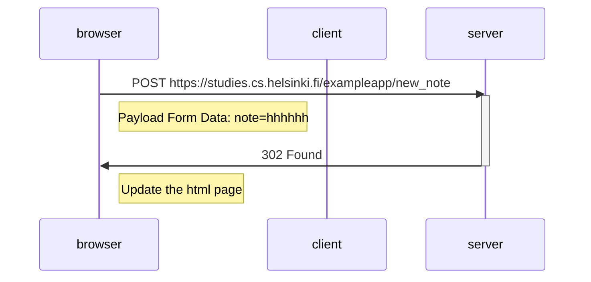

# Exerise
## Exercise 0.1

## Exercise 0.4 Mermaid

```mermaid
sequenceDiagram
    participant browser
    participant client

    browser->>server: POST https://studies.cs.helsinki.fi/exampleapp/new_note
    activate server
    Note right of browser: Payload Form Data: note=hhhhhh
    server->>browser: 302 Found
    deactivate server
    Note right of browser: Update the html page
```

## Exercise 0.5 Single page app diagram

## Exercise 0.6 New note in Single page app diagram
